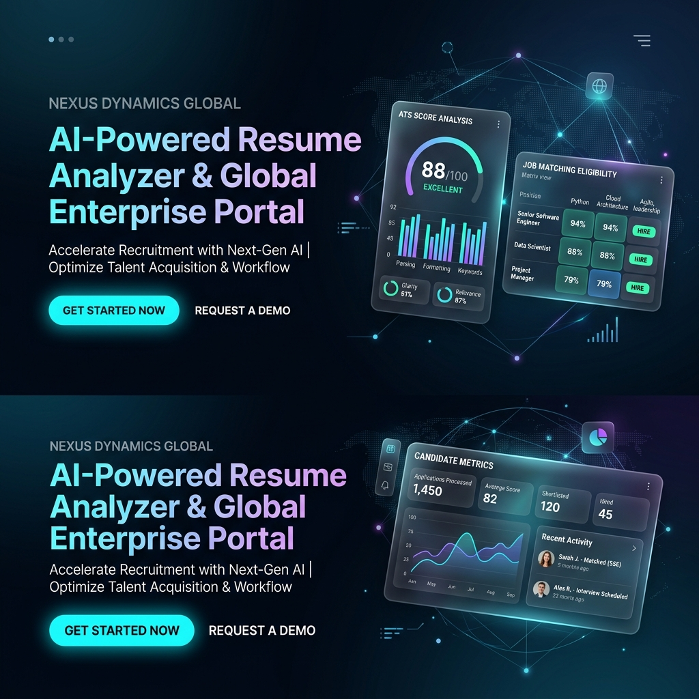

<div align="center">

# 🌐 NEXUS DYNAMICS GLOBAL
### Fortune 500 Enterprise Platform & AI-Powered Career Suite



[](https://reactjs.org/)
[](https://www.typescriptlang.org/)
[](https://vitejs.js.org/)
[](https://tailwindcss.com/)
[](https://nodejs.org/)
[](https://www.mongodb.com/)

**Unified enterprise web portal featuring an intelligent AI Resume Analyzer, ATS Score Audit, Job Fit Matrix, Interactive Interview Studio, and Candidate Database Management.**

[🚀 Explore Live Demo](#-quick-start) • [✨ Key Features](#-features) • [🛠 Tech Stack](#-tech-stack) • [📁 Directory Structure](#-project-structure)

---

</div>

## ✨ Features

- 🤖 **AI Resume Analyzer & ATS Audit**
  - Instant PDF/Text parsing with section completeness checking.
  - Keyword density matrix, formatting score, and impact verb evaluation.
  - Actionable recommendations to boost ATS compatibility score.

- 🎯 **Company Job Matching Matrix**
  - Real-time compatibility calculation against open corporate positions.
  - Automated qualification verification (Degree level, minimum experience, skill overlap).
  - Explicit PASS/FAIL eligibility status determination.

- 🎤 **Interactive Interview Studio**
  - Practice role-specific interview questions (Technical, System Design, Behavioral).
  - Voice recording & real-time transcript analysis.
  - Performance scoring with strength feedback and sample answer guides.

- 🗃️ **Candidate Database & Records**
  - Persisted candidate evaluations with search, filtering, and detail inspection.
  - Multi-channel report dispatch: Direct Web API, Gmail Web Composer, or Native Mail Client.
  - Single-page formatted PDF report export.

- 🎨 **Dynamic Design & Customization**
  - 5 Premium Color Themes: *Electric Violet, Royal Sapphire, Cyber Emerald, Sunset Crimson, Midnight Titanium*.
  - Native Dark & Light theme modes.
  - 6 Supported Languages: English, Hindi, Gujarati, Spanish, French, German.

---

## 📁 Project Structure

```
COMPNAY PORTAL/
├── 📁 Frontend/          # React 18 + TypeScript + Vite Client App
│   ├── 📁 src/
│   │   ├── 📁 components/ # Reusable UI components (Navbar, Footer, Modals)
│   │   ├── 📁 pages/      # Application views (Home, Careers, Analyzer, DB)
│   │   ├── 📁 utils/      # Resume parser, ATS evaluator, PDF generator
│   │   ├── 📁 data/       # Mock jobs, sample resumes, translations
│   │   └── 📁 types/      # TypeScript interfaces and schemas
│   └── package.json
│
├── 📁 Backend/           # Node.js + Express API Server
│   ├── 📁 src/
│   │   ├── 📁 config/     # MongoDB connection setup
│   │   ├── 📁 models/     # Mongoose Schemas (Candidate, Job)
│   │   ├── 📁 routes/     # Express API endpoints
│   │   └── server.ts      # Server entry point
│   └── package.json
│
├── 📁 MobileApp/         # React Native / Cross-platform app (Coming Soon)
├── 📁 assets/readme/     # Banner images and README visual assets
├── 📁 scripts/          # Deployment and CI/CD helper scripts
├── 📄 render.yaml        # Render.com unified deployment config
└── 📄 README.md          # Project documentation
```

---

## 🛠 Tech Stack

| Domain | Technology | Description |
|---|---|---|
| **Frontend Framework** | React 18 + Vite 5 | Fast component rendering and lightning HMR |
| **Language** | TypeScript 5 | End-to-end type safety |
| **Styling** | Tailwind CSS + Vanilla CSS | Custom design system & animations |
| **Icons** | Lucide React | Modern minimalist icons |
| **Backend API** | Node.js + Express | RESTful API microservices |
| **Database** | MongoDB + Mongoose | Candidate & Job document database |
| **Document Export** | jsPDF / HTML2Canvas | Client-side PDF generation |
| **Email Gateway** | FormSubmit / Gmail Web API | Automated evaluation report delivery |

---

## 🚀 Quick Start

### Prerequisites
- **Node.js**: v18.x or higher
- **npm**: v9.x or higher

### 1. Clone & Install
```bash
git clone https://github.com/OMTHAKKAR8495/AWT-PROJECT.git
cd AWT-PROJECT
npm install
```

### 2. Run Frontend
```bash
npm run dev
# App will launch at http://localhost:5173
```

### 3. Run Backend (Optional)
```bash
cd Backend
npm install
npm start
# API server starts at http://localhost:5001
```

---

<div align="center">

Developed with ❤️ for **Nexus Dynamics Global Enterprise Group**.

</div>
